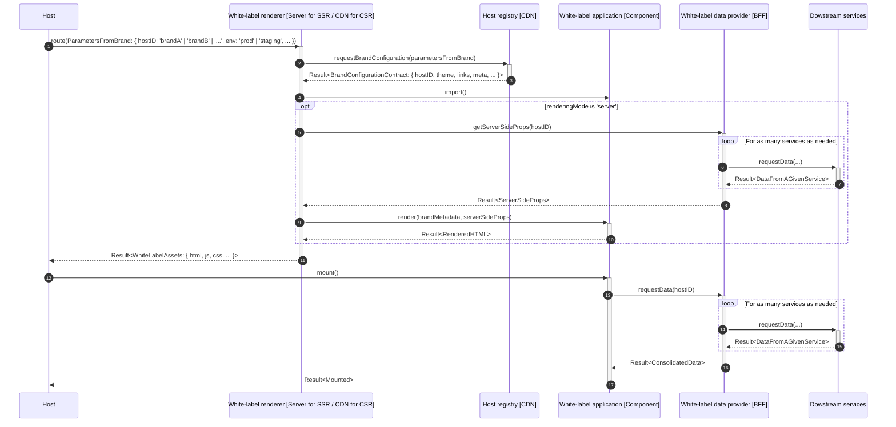

# poc-white-label

A white-label solution proposal

## Scope

For the sake of experimentation, a simple white-label product version will be implemented.
It consists of displaying a welcome page into two brands (arbitrary called `brandA` and `brandB`) with following requirements:

- [ ] Shared logic: a common business logic including metadata, content & feature
- [ ] Brand-specific configuration: UI with logo and button
- [ ] Brand-specific configuration: metadata with the title tag
- [ ] Brand-specific configuration: link to a specific page
- [ ] Brand-specific configuration: feature toggle

## Architecture

### Overview

Before describing each integration proposal, let's see what are the main technical building blocks (containers and components) shared between proposals:

Four main containers compose the integration framework:

- Host: The brand application consuming the white-label
- Host registry: Global brand registry providing brand-aware configurations (HTML, metadata, theme, ...). It adapts the white-label experience with brand requirements
- White-label: The white-label product to adapt and integrate into an host target
- Downstream services: Provide needed data from a given source (eg. backend service, authorization server, third party service like feature flag system, ...)

Let's zoom into the white-label container by listing its components:

- Renderer: Top-level wrapper managing the white-label application rendering (including brand configuration consumption)
- Application: Implement the core business logic (shared between brands)
- Data provider: Manage communication with external systems (ACL) and deliver the consolidated data to the requestor

### Multi-tenant architecture

Single shared renderer between brands configurable via a registry.

##### Component diagram

##### Sequence diagram

### Single-tenant architecture

Multi renderers (one per brand to manage each one specificity).

