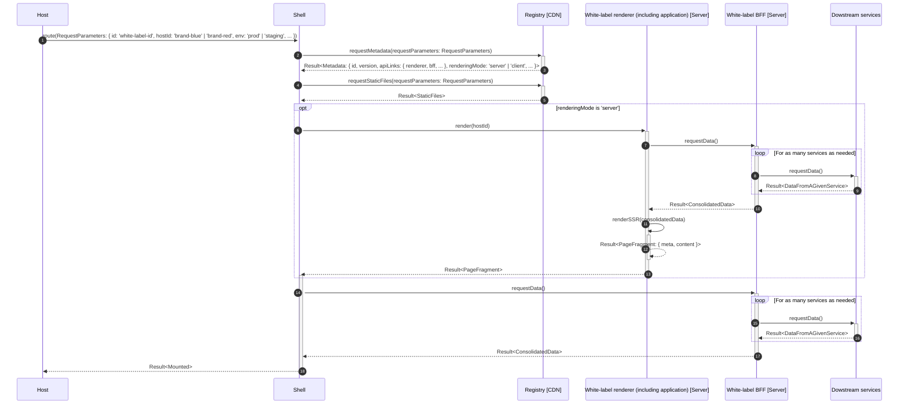
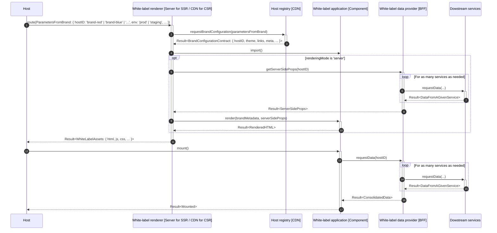

# poc-white-label

A white-label solution proposal

# Scope

For the sake of experimentation, a simple white-label product version will be implemented.
It consists of displaying a welcome page into two brands (arbitrary called `brand-red` and `brand-blue`) with following requirements:

- [ ] Shared logic: a common business logic including metadata, content & feature
- [ ] Brand-specific configuration: UI with logo and button
- [ ] Brand-specific configuration: metadata with the title tag
- [ ] Brand-specific configuration: link to a specific page
- [ ] Brand-specific configuration: feature toggle
- [ ] Brand-specific configuration: serve specific assets (robots.txt)
- [ ] SSR friendly

# Architecture

## Overview

Before describing each integration proposal, let's see what are the main building blocks shared between proposals:

Four containers compose the integration system:

- **Tenant**: The brand application hosting the white-label application
- **Shell**: The integration orchestrator. Its main responsibility is to enable the white-label application integration into the tenant in the best possible conditions (eg. retrieving the white-label logic, decorating it with tenant-aware configuration, managing its loading lifecycle, ...)
- **Registry**: Global white-label registry to discover and serve critical white-label resources (by critical, we mean all resources (URL, metadata, static files) needed to display the white-label)
- **White-label**: The white-label application to adapt and integrate into a tenant
- **Downstream services**: Provide needed data from a given source (eg. backend service, authorization server, third party service like feature flag system, ...)

Let's zoom into the white-label container by enumerating its components:

- **Renderer**: Top-level wrapper managing the white-label rendering (including brand configuration consumption)
- **Application**: Core business logic implementation (shared across brands)
- **BFF (Backend For Frontend)**: Manage communication with external systems and deliver the consolidated data to the requestor. It acts as an ACL and consolidated data provider for the white-label needs

## Multi-tenant architecture

One white-label instance shared across tenants (a single software runtime serves multiple customers).

#### Component diagram

#### Sequence diagram

## Single-tenant architecture

One white-label instance per tenant (a single software runtime serves a single customer).

