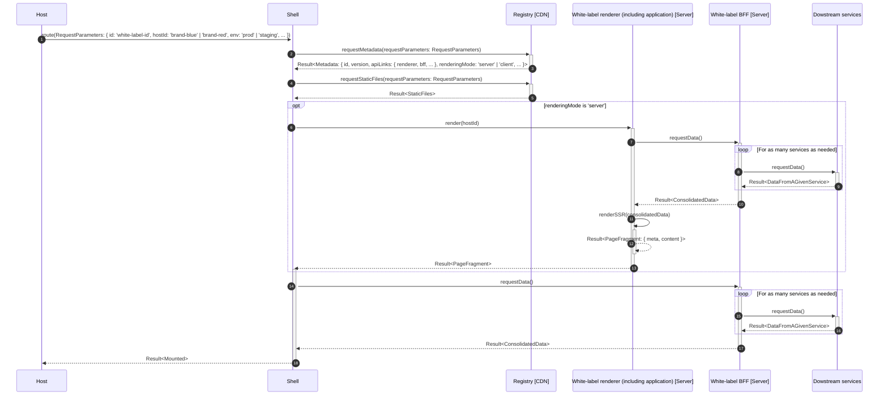
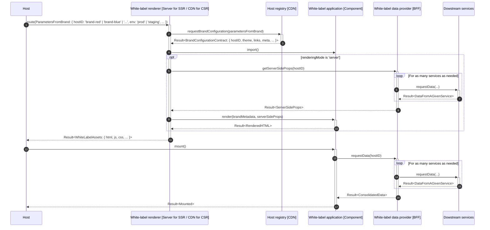

<div align="center">
    <h1>🧪 Multi-tenant architecture proposal</h1>
    <strong>One white-label infrastructure shared across tenants (a single software runtime serves multiple customers)</strong>
</div>
<br>
<br>

## 🚀 Quickstart

1️⃣ Install by running:

```bash
pnpm i
```

2️⃣ Try it by running:

```bash
pnpm start:multi-tenant
```

<br>

## 🏗 Architecture

### Component diagram


### Sequence diagram





## Assessment

_TODO_
