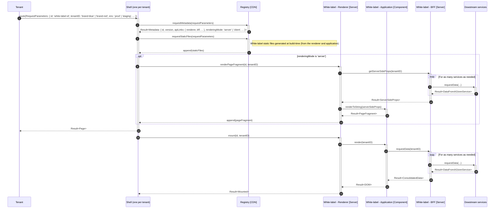

<div align="center">
    <h1>🧪 Multi-tenant architecture proposal</h1>
    <strong>One white-label infrastructure shared across tenants (a single software runtime serves multiple customers)</strong>
</div>
<br>
<br>

## 🚀 Quickstart

1️⃣ Install by running:

```bash
pnpm i
```

2️⃣ Try it by running:

```bash
pnpm start:multi-tenant
```

<br>

## 🏗 Architecture

### Component diagram


If we compare with single-tenant solutions, a new component is added to the integration system: the global white-label registry. Its responsibility is to discover and serve critical white-label resources (by critical, we mean all resources (URL, metadata, static files) needed by each tenant shell to display the white-label.

### Sequence diagram



## Assessment

_TODO_
